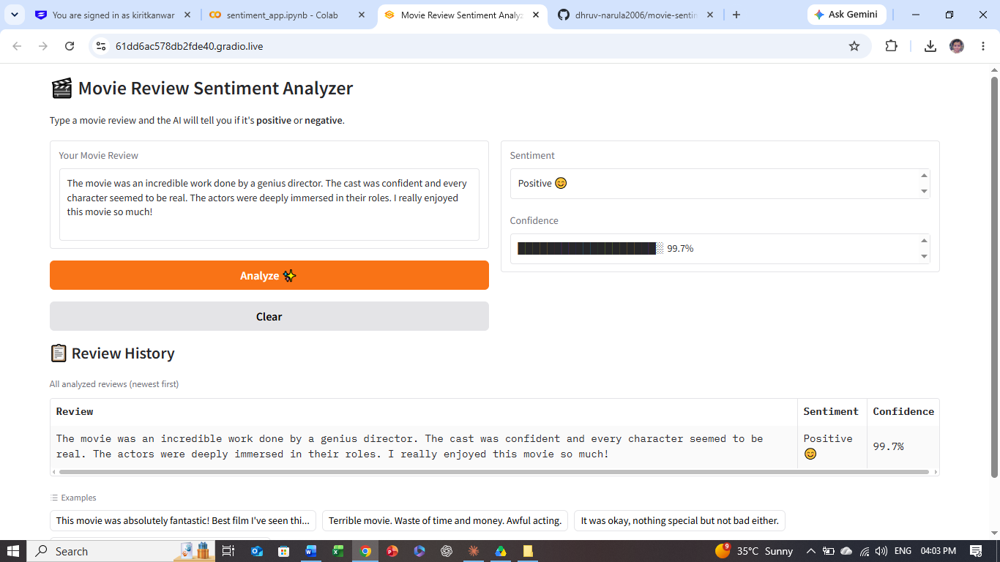
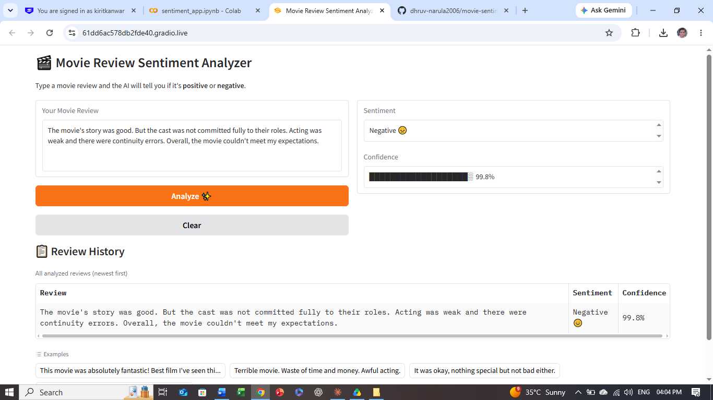

# 🎬 Movie Review Sentiment Analyzer

A fine-tuned **DistilBERT** model that classifies movie reviews as **positive** or **negative** with high confidence. Built and deployed end-to-end using Google Colab, Hugging Face, and Gradio.

---

## 🚀 Live Demo
👉 Try the app: [Hugging Face Spaces](https://huggingface.co/spaces/naruladhruv2006/movie-sentiment-analyzer)
👉 Model on Hub: [naruladhruv2006/movie-sentiment-analyzer](https://huggingface.co/naruladhruv2006/movie-sentiment-analyzer)

---

## 📸 Screenshots

### Positive Review

### Negative Review

---

## 📊 Model Performance
| Metric | Score |
|---|---|
| Dataset | IMDB (50,000 reviews) |
| Base Model | DistilBERT-base-uncased |
| Training Epochs | 3 |
| Confidence on test sentences | ~99% |

---

## 📁 Project Structure
movie-sentiment-analyzer/

│

├── fine_tuning.ipynb       # Train the model on IMDB dataset

├── sentiment_app.ipynb     # Gradio web app

└── README.md

---

## ⚙️ How It Works
1. User types a movie review
2. Text is tokenized using DistilBERT tokenizer
3. Fine-tuned model predicts positive or negative
4. Confidence score is displayed as a visual bar

---

## 🛠️ Tech Stack
- **Model** — DistilBERT (Hugging Face Transformers)
- **Dataset** — IMDB Movie Reviews (50,000 samples)
- **Training** — Google Colab (T4 GPU)
- **App** — Gradio
- **Storage** — Google Drive + Hugging Face Hub

---

## 🏃 How to Run

### Train the model
1. Open `fine_tuning.ipynb` in Google Colab
2. Enable GPU: Runtime → Change runtime type → T4 GPU
3. Run all cells

### Launch the app
1. Open `sentiment_app.ipynb` in Google Colab
2. Run all cells
3. Click the Gradio public URL

---

## 👨‍💻 Author
**Dhruv Narula**
- GitHub: [@dhruv-narula2006](https://github.com/dhruv-narula2006)
- Hugging Face: [@naruladhruv2006](https://huggingface.co/naruladhruv2006)
